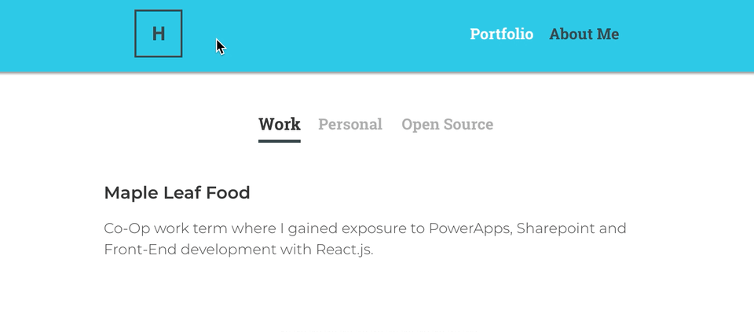
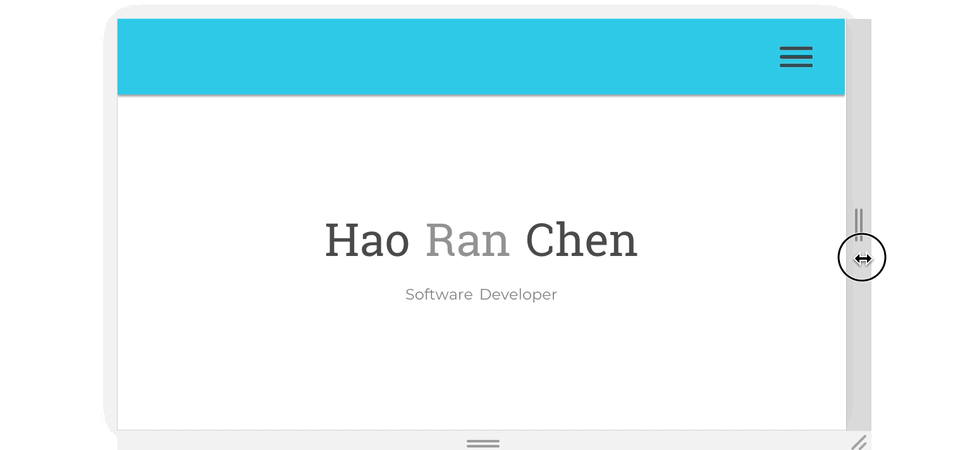
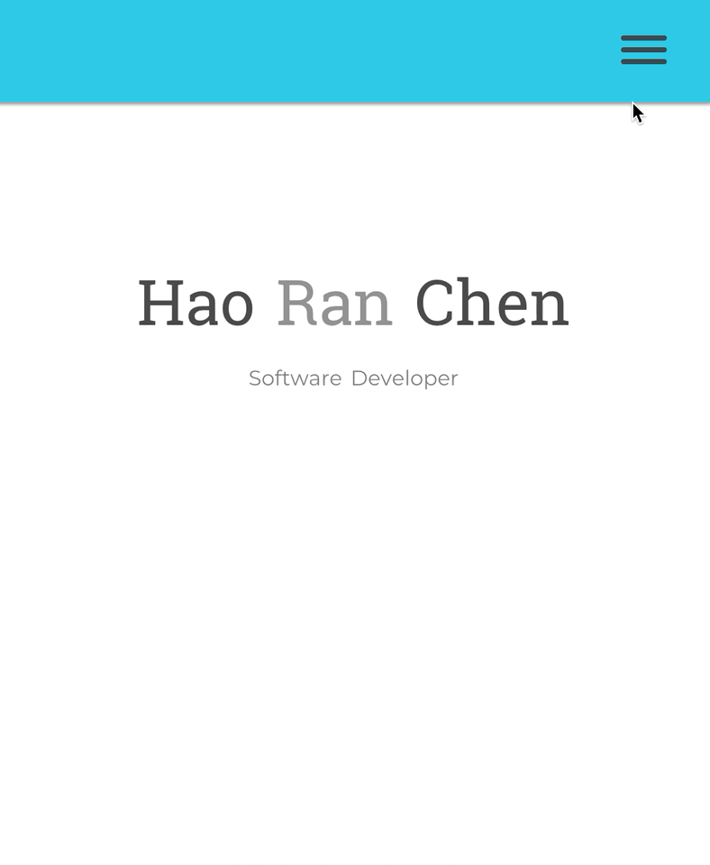

# Personal Portfolio Website Version 1

A personal project for myself to learn more about Front-End web development. Also, a portal to present my tech related activities. 

What I learned: 

1. High fidelity prototyping with Sketch App(Mac OS).
2. I started the project with basic knowledge of CSS(changing color, changing height/width). By the end, I learned how to use:
    * Sass(BEM)
    * Flexbox
    * Transitions
    * Animations(Keyframes)
    * Experimented with a wide variety of CSS Tags, pseudo classes and elements. 
3. DOM manipulation with Javascript and deeper understanding of Vue lifecycle. 

The following are learning goals for version 2 of the portfolio:

1. Explore accessibility in websites.(not considered at all within current site)
2. Adhere more strickly to BEM style for Sass. (Broken multiple times in this project)
3. Dive deeper into Vue.js and use Vuex for state management. (Current site relies on component state)
4. Smaller and more modular Vue components. (Size of current Vue components are quite large)
5. Mobile first development. (Styled site starting from desktop Media query)

